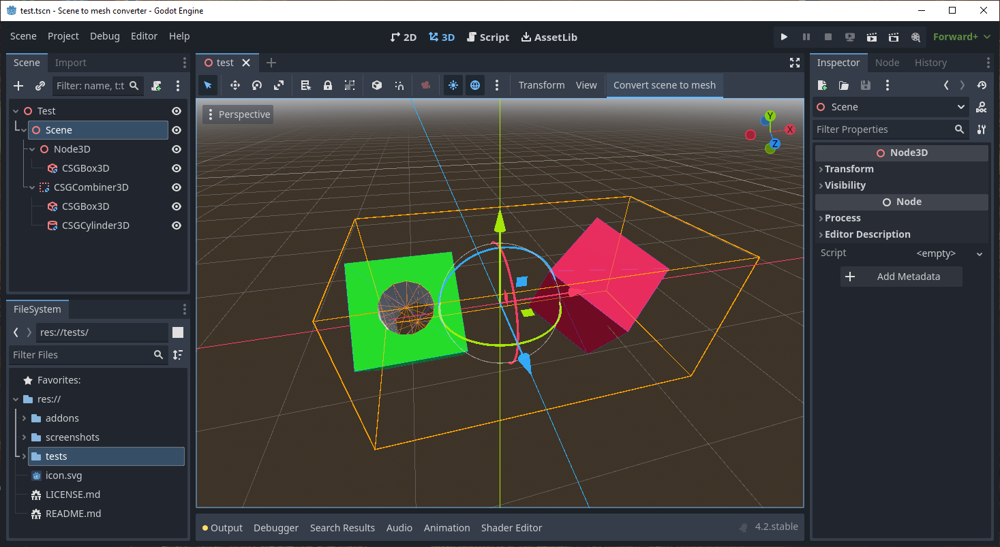
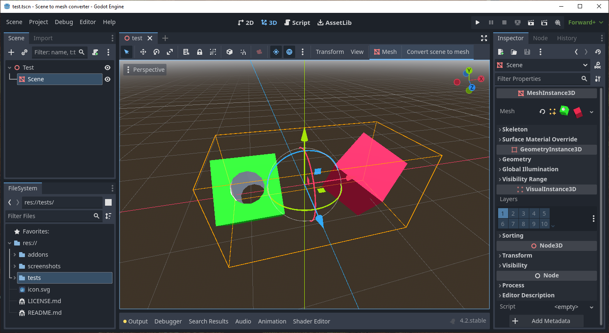

# Scene to mesh converter

The **Scene to mesh converter** is a tool that convert a hierarchy of Node3D nodes into a MeshInstance3D.

# How does it work?
1. Select a node to convert.
2. Push the **Convert scene to mesh** button on the Spatial editor menu.
3. The scene is replaced with a MeshInstace3D.

> [!NOTE]
> If you would like to keep the scene tree, please make a copy before converting. Undo/Redo might still have issues.

> [!IMPORTANT]
> It is best for the node you want to convert to have default transform (Transform(0,0,0)). Otherwise the child meshes will be translated by the node's transform and as a result, they will be misplaced.

## Screenshots

